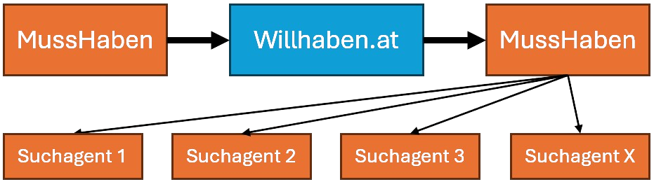
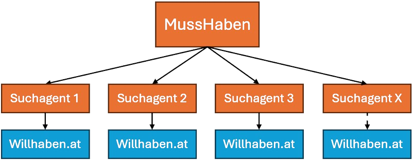

# MussHaben

**The advanced willhaben search agent.**

This project is a PWA web application that allows users to create search agents for specific product categories on the Willhaben website.
Unlike the existing built-in search agent, this application notifies users of new products only in a matter of minutes instead of hours.

## Problem

The existing built-in search agent on the Willhaben website is not efficient in notifying users of new products. It can take hours for users to receive notifications about new products that match their search criteria, which can lead to missed opportunities and frustration.

## Disclaimer

This project was created for educational purposes only and is not intended for commercial use. Use this application at your own risk and be aware of the potential consequences.

## Restrictions

The project was built as a hobby project and is not intended for commercial use.
For this reason, I have implemented the following:
- a maximum number of search agents per user
- an imprecise, indeterministic request technique (see section below)

This is to prevent abuse of the application and to ensure that it remains a fun and educational project for everyone._

### Changing Maximum Search Agents

To change the maximum number of search agents per user, you can modify the `MAX_SEARCH_AGENTS_WITHOUT_PREMIUM` config constant in `src/config/maximumAgents.ts`.
Additionally the firstore rules need to be updated to reflect the new maximum number of search agents per user. The rules can be found in `firestore.rules`.

## Search Agent Request Architecture

### How MussHaben Works

MussHaben uses different methods to search for new product listings on Willhaben. Each method has its own advantages and limitations due to Willhaben's recommendation algorithm.

### Bundled Request - Currently Used Method

MussHaben sends a single request to retrieve all the latest listings since the last update. This method sends only one request for all search agents, making it very efficient.

However, due to Willhaben's recommendation algorithm being non-deterministic, it is difficult to retrieve all new listings without gaps. As a result, MussHaben may miss some new listings if they don't appear in the top results of the search.

### Individual Requests

In this method, MussHaben sends a separate request for each search agent to retrieve the latest listings. Since a more limited number of listings are retrieved with this method, the search queries are deterministic when the result set is small.

This ensures that all new listings are found if they appear in the top results of the search.

## Development

### Start-Up

To start the development environment, we need to start:
- the firebase emulator's: `firebase emulators:start --import=./emulator-data --export-on-exit=./emulator-data`
- the react vite frontend: `cd frontend && npm run dev`

### Deployment

#### Frontend

The frontend is deployed on firebase hosting automatically on every push to the main branch. Alternatively, you can deploy the frontend to firebase hosting by running `firebase deploy --only hosting` from the root of the project.

#### Backend

To deploy the application to firebase run `firebase deploy --only "firestore,functions,auth"` from the root of the project.
